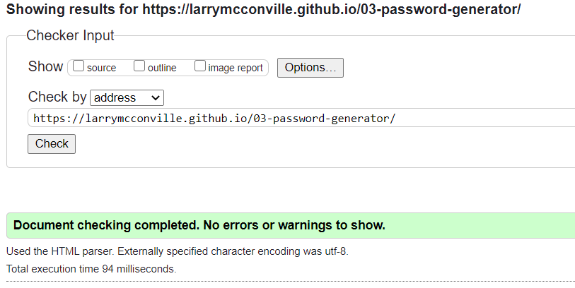

# 03-password-generator

## Project Goal

Create an application employees can use to generate a random password based upon criteria they’ve selected through the application interface. The app will run in the browser, and feature dynamically updated HTML and CSS powered by JavaScript. The application shall have a clean user interface that is responsive, ensuring that it adapts to multiple screen sizes.

If the user elects to utilize special characters in the generated password, the list should include special characters as identified by the [list of Password Special Characters from the OWASP Foundation](https://www.owasp.org/index.php/Password_special_characters).

## User Story

```
AS AN employee with access to sensitive data
I WANT to randomly generate a password that meets certain criteria
SO THAT I can create a strong password that provides greater security
```

## Acceptance Criteria

```
GIVEN I need a new, secure password
WHEN I click the button to generate a password
THEN I am presented with a series of prompts for password criteria
WHEN prompted for password criteria
THEN I select which criteria to include in the password
WHEN prompted for the length of the password
THEN I choose a length of at least 8 characters and no more than 128 characters
WHEN prompted for character types to include in the password
THEN I choose lowercase, uppercase, numeric, and/or special characters
WHEN I answer each prompt
THEN my input should be validated and at least one character type should be selected
WHEN all prompts are answered
THEN a password is generated that matches the selected criteria
WHEN the password is generated
THEN the password is either displayed in an alert or written to the page
```
## Solution
JavaScript has been utilized to implement the desired application logic.  When a user clicks the `Generate Password` button they are first prompted to enter the desired password length of between 8 and 128 characters.  Input validation has been implemented to enforce the length and data type submitted. After a user has submitted the password length they receive a series of questions seeking confirmation specific to the character types they would like included in their password. They may choose from `special`, `lower case`, `upper case` and `number 0-9` characters.

When the user has completed answering the final question, their selections are evaluated to ensure they have selected at least one character set. If not, the user is alerted that they **must make at least one selection**, no logic is executed, and the user must start by re-entering the password length. If selection criteria has been satisfied the `generatePassword()` combines the candidate child arrays into a single `combinedArray`.

The `generatePassword()` iterates over the combinedArray for the length of the password arguement.  Each iteration performs the following:
* The use of `Math.random()` to generate a random decimal number between 0 - 1 (1 exclusive).
* The random decimal is multiplied by the `combinedArray.length` to get the numbers between 0 and the length of the combinedArray.
* Use `Math.floor()` to get an integer ranging from 0 to `combinedArray.length - 1` which then serves as the `combinedArray index`.
* The newly generated character is appened to the `newUserPassword` variable.

When the loop is completed the newly generated password is returned from `generatePassword()` to `writePassword()` where it is presented to the user in the `index.html` UI.  The `newUserPassword` and `combinedArray` variables are re-initialized each time the user clicks the `Generate Password` button so that multiple passwords may be generated within the same Browser session.

## HTML
`scripts` and `style` subdirectories were created for code organization.  The paths to these resources were modified in the HTML.

## Mock-Up

The following image shows the web application's appearance and functionality:


The application html was scanned with the [Markup Validation Service](https://validator.w3.org/).


## Sources Referenced

[w3schools](https://www.w3schools.com/html/) `|` 
[geeksforgeeks](https://www.geeksforgeeks.org/how-to-select-a-random-element-from-array-in-javascript/)